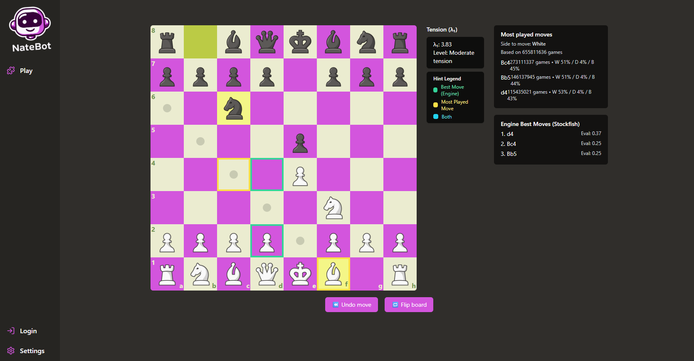
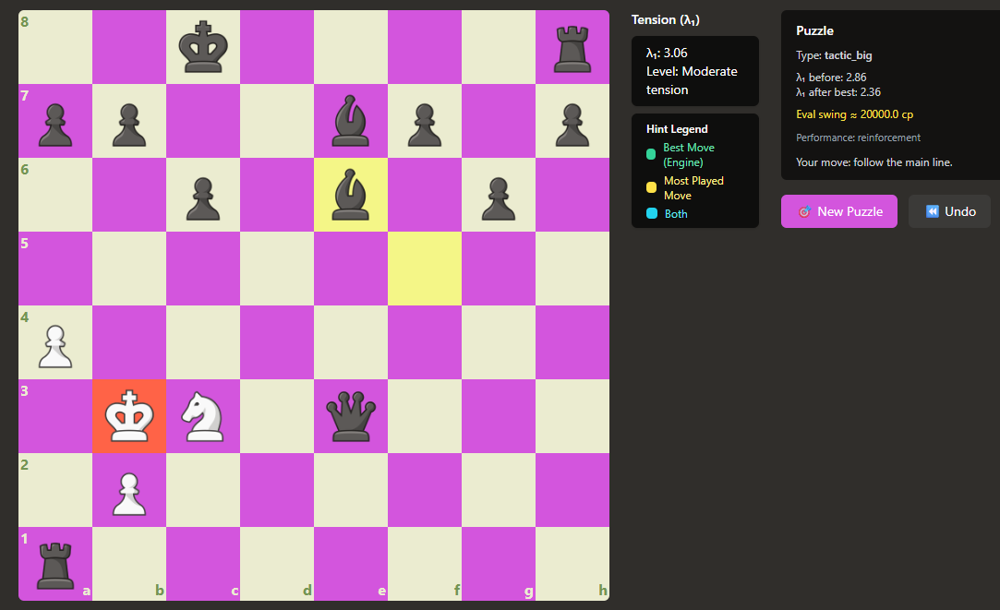

# NateBot 🤖  
## Real-Time Chess Complexity & Tension ($\lambda_1$) Analyzer

NateBot is an interactive chess training system focused on **understanding positions rather than memorizing lines**.  
It introduces the first practical, real-time implementation of **($\lambda_1$) Strategic Tension** — a graph-theoretic metric of positional complexity derived from combinatorial research and integrated with modern computational analysis.

The project aims to augment human decision-making by translating abstract structural complexity into **actionable, quantitative signals** during play.

---

---

## 🎯 Why $\lambda_1$ Matters

Empirical and theoretical insights reveal a fundamental divergence between **human cognition** and **engine optimization**:

- Humans avoid **high $\lambda_1$ positions** (volatile, highly interconnected states) because working memory degrades under combinatorial load.
- Chess engines deliberately **seek high $\lambda_1$ positions**, where deep search thrives on tactical complexity.

This asymmetry explains:

- why humans blunder under pressure  
- why certain openings feel *“easier”* or more intuitive  
- why simplification increases as Elo rises  
- how players can steer games into positions they understand better  

NateBot exposes this hidden structural layer **in real time**.

---

## 🧠 Graph-Theoretic Model

### Representation

- **Nodes:** all pieces on the board  
- **Edges:** attack / defense relationships  

### Adjacency Matrix

$$
A_{ij} =
\begin{cases}
1 & \text{if piece } i \text{ attacks or defends piece } j \\
0 & \text{otherwise}
\end{cases}
$$

Properties:
- Symmetric  
- Unweighted  

---

### Strategic Tension

$$
\text{Strategic Tension} = \lambda_1(A)
$$

Where $\lambda_1$ is the **largest eigenvalue** of the adjacency matrix, computed live after every move.

---

## 📊 Interpretation

### High $\lambda_1$
- Highly interconnected, tactical, volatile positions  
- More forks, skewers, forcing lines  
- Rapid evaluation swings  
- Engines thrive here; humans are prone to error  

### Low $\lambda_1$
- Simplified, stable, positional structures  
- Fewer forcing continuations  
- Slow evaluation drift  
- Generally more *comfortable* for human play  

---

## 📦 Features

### 📊 Most Played Moves
- Live statistics from the **Lichess API**

### 🤖 Engine Best Moves
- Integrated local **Stockfish** evaluation

### 🎨 Visual Board Hints
- 🟨 **Yellow** — most played by humans  
- 🟩 **Green** — engine-best line  
- 🟦 **Cyan** — agreement between human preference and engine evaluation  

---

## ♟️ Self-Play Trainer Mode

- Play both sides freely  
- $\lambda_1$ and volatility update instantly after each move  
- Custom board themes, colored squares, and UI indicators  

Designed for **experimentation, intuition-building, and structural learning**.

---
## 🎯 Custom Puzzles based on your PGN's using Machine Learning !
(Note: Parser is Built in)

## 🎯 Philosophy

NateBot is not about replacing intuition — **it is about making intuition legible**.

By exposing the spectral structure of positions, the system bridges:

- combinatorics  
- linear algebra  
- graph theory  
- human-centered decision modeling  

into a single, interpretable training environment.
